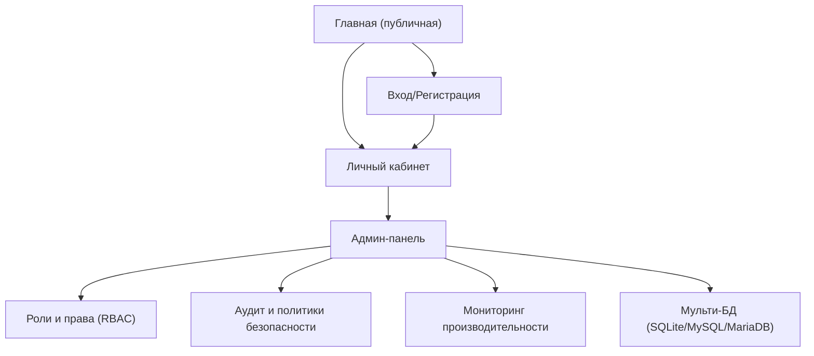

## 1. Product Overview
Веб‑приложение (публичная часть + личный кабинет + админ‑панель), которое требуется модернизировать.
Цель: ускорить работу, усилить безопасность, переработать UI/UX (дизайн‑система, WCAG 2.1, dark mode) и стандартизировать роли через JWT при работе с несколькими БД (SQLite + MySQL/MariaDB).

## 2. Core Features

### 2.1 User Roles
| Роль | Способ регистрации | Core Permissions |
|------|---------------------|------------------|
| Гость (anon) | Без регистрации | Просматривать публичные страницы; переключать тему (light/dark). |
| Пользователь (authenticated) | Регистрация / вход | Работать в личном кабинете; управлять настройками аккаунта и безопасности; просматривать доступные данные согласно RBAC. |
| Администратор (admin) | Назначается администратором | Управлять ролями/правами; настраивать безопасность; контролировать производительность; управлять режимами/подключениями к БД и миграциями. |

### 2.2 Feature Module
Минимальный набор страниц для реализации требований:
1. **Главная (публичная)**: навигация, переключатель темы, базовые UX/Accessibility паттерны, быстрые загрузки.
2. **Вход/Регистрация**: аутентификация, выпуск JWT, восстановление сессии.
3. **Личный кабинет**: защищённые разделы, управление профилем/сессиями, UI/UX настройки.
4. **Админ‑панель**: RBAC (роли/права), аудит и политики безопасности, мониторинг производительности, управление мульти‑БД.

### 2.3 Page Details
| Page Name | Module Name | Feature description |
|-----------|-------------|---------------------|
| Главная (публичная) | Производительность фронтенда | Загружать контент быстро за счёт оптимизации критического рендера (SSR/SSG где применимо), ленивой загрузки некритичных блоков, оптимизации изображений, кэширования статических ресурсов. |
| Главная (публичная) | UI/UX: дизайн‑система + WCAG 2.1 + dark mode | Применять единые токены (цвет/типографика/отступы), обеспечивать контраст и фокус‑состояния, корректную навигацию с клавиатуры, семантику/ARIA; переключать тему и сохранять выбор пользователя. |
| Вход/Регистрация | Аутентификация и JWT | Выполнять вход/регистрацию; выпускать JWT с клеймами ролей; безопасно хранить токены (httpOnly cookies); поддерживать обновление/завершение сессии. |
| Вход/Регистрация | Защита от злоупотреблений | Ограничивать частоту попыток, логировать подозрительную активность, показывать безопасные сообщения об ошибках (без утечек деталей). |
| Личный кабинет | RBAC‑доступ и безопасность сессии | Показывать разделы/действия по правам; проверять JWT и права на каждом защищённом запросе; отображать активные сессии и позволять завершать их. |
| Личный кабинет | Настройки UI/UX | Управлять темой (light/dark/system) и базовыми настройками доступности (например, уменьшение анимаций), применяя их глобально. |
| Админ‑панель | Управление ролями (JWT/RBAC) | Создавать/редактировать роли; назначать роли пользователям; управлять матрицей разрешений (страницы/действия) и встраивать её в JWT клеймы/проверки. |
| Админ‑панель | Аудит и политики безопасности | Просматривать журнал аудита (входы, изменения ролей, изменения настроек БД/безопасности); управлять политиками (время жизни сессии, требования к паролю, правила блокировок). |
| Админ‑панель | Мониторинг производительности | Просматривать ключевые метрики (TTFB/LCP/CLS на фронте, p95 latency по API, ошибки, медленные запросы); инициировать профилирование/диагностику (в рамках доступных инструментов). |
| Админ‑панель | Мульти‑БД: SQLite + MySQL/MariaDB | Переключать режим работы (локальный SQLite / серверный MySQL/MariaDB); проверять доступность подключений; управлять миграциями/совместимостью схемы; предотвращать потерю данных при переключении. |

## 3. Core Process
**Поток гостя (anon)**
1) Открываешь главную страницу.
2) Переключаешь тему (light/dark/system) — выбор сохраняется.
3) Переходишь на страницу входа/регистрации при необходимости защищённых функций.

**Поток пользователя (authenticated)**
1) Выполняешь вход/регистрацию.
2) Приложение выпускает JWT с ролью(ями) и выдаёт доступ только к разрешённым разделам.
3) Работаешь в личном кабинете; при необходимости завершаешь активные сессии.

**Поток администратора (admin)**
1) Вход в админ‑панель.
2) Управление ролями и правами (RBAC) и проверка, что доступы корректно отражаются в поведении UI/API.
3) Просмотр аудита и обновление политик безопасности.
4) Мониторинг метрик производительности.
5) Управление режимом БД (SQLite ↔ MySQL/MariaDB), проверка подключения и применение миграций.

