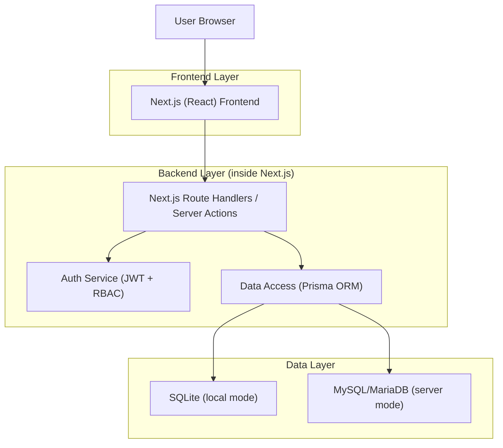
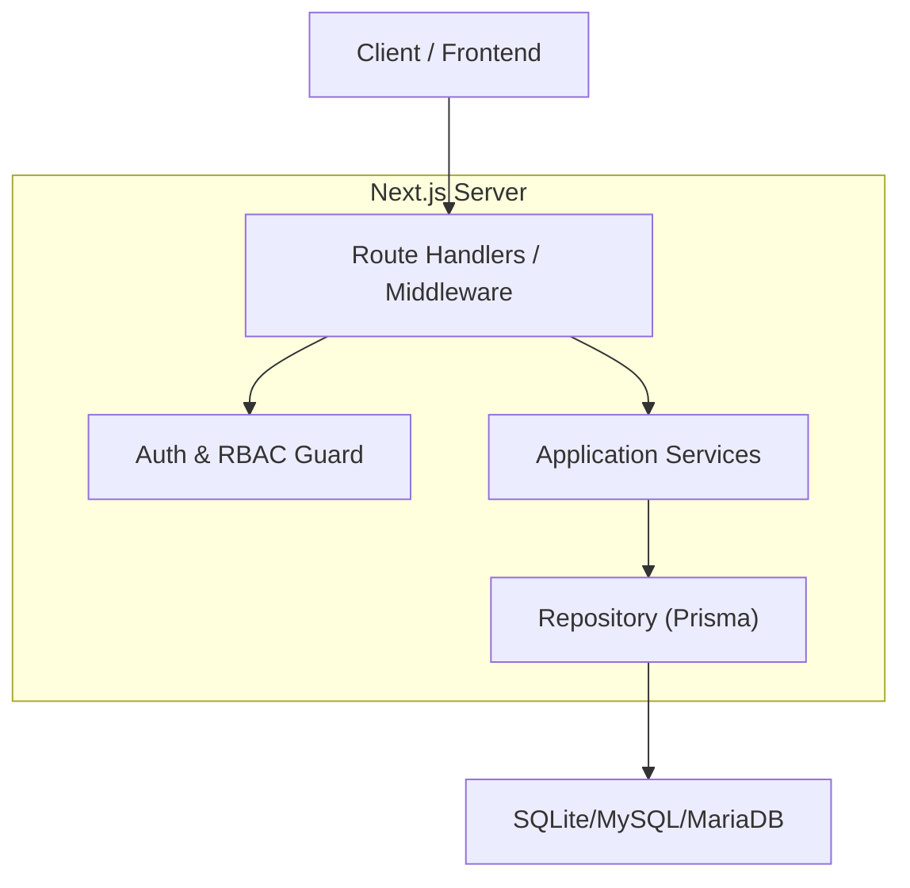
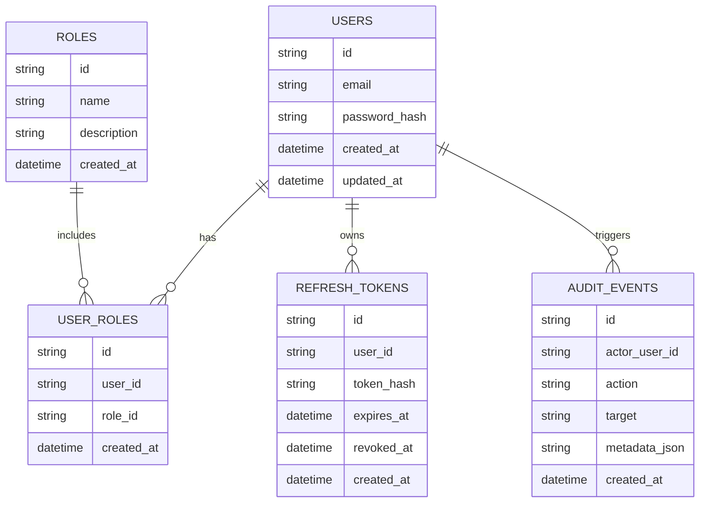

## 1.Architecture design


## 2.Technology Description
- Frontend: Next.js (React@18) + TypeScript + CSS variables (design tokens) + (опционально) TailwindCSS для утилитарной вёрстки
- Backend: Next.js Route Handlers / Server Actions (Node.js runtime)
- Auth: JWT (access) + refresh token (ротация) + httpOnly cookies
- Database: SQLite (dev/edge/локальный режим) + MySQL/MariaDB (prod/серверный режим)
- ORM/Migrations: Prisma

## 3.Route definitions
| Route | Purpose |
|-------|---------|
| / | Публичная главная: быстрый рендер, навигация, переключение темы, базовые WCAG паттерны |
| /login | Вход и выпуск JWT/создание сессии |
| /register | Регистрация и выпуск JWT/создание сессии |
| /lk | Личный кабинет: защищённые разделы по RBAC |
| /lk/settings | Настройки пользователя: тема (light/dark/system), управление сессиями |
| /admin | Админ‑панель: доступ только admin |
| /admin/settings | Политики безопасности и системные настройки |
| /admin/analytics | Обзор метрик производительности/ошибок |
| /admin/security | Роли/права (RBAC), аудит |
| /admin/databases | Мульти‑БД: состояние, проверка подключения, миграции |

## 4.API definitions (If it includes backend services)

### 4.1 Shared TypeScript types
```ts
export type Role = "anon" | "authenticated" | "admin";

export type JwtClaims = {
  sub: string; // userId
  roles: Role[];
  iat: number;
  exp: number;
};

export type Permission = {
  resource: string; // e.g. "admin.security", "admin.databases", "lk.settings"
  actions: ("read" | "write" | "manage")[];
};

export type AuditEvent = {
  id: string;
  actorUserId: string | null;
  action: string;
  target: string | null;
  metadata?: Record<string, unknown>;
  createdAt: string;
};

export type DbMode = "sqlite" | "mysql";

export type DbHealth = {
  mode: DbMode;
  ok: boolean;
  latencyMs?: number;
  error?: string;
};
```

### 4.2 Core API
Auth
- `POST /api/auth/login`
- `POST /api/auth/register`
- `POST /api/auth/refresh`
- `POST /api/auth/logout`

Admin (RBAC)
- `GET /api/admin/roles`
- `POST /api/admin/roles`
- `PUT /api/admin/roles/:id`
- `POST /api/admin/users/:id/roles`

Admin (Audit)
- `GET /api/admin/audit`

Admin (Multi-DB)
- `GET /api/admin/databases/health`
- `POST /api/admin/databases/switch` (переключение режима: sqlite/mysql)
- `POST /api/admin/databases/migrate` (запуск миграций)

Performance
- `GET /api/admin/performance/summary`

## 5.Server architecture diagram (If it includes backend services)


## 6.Data model(if applicable)

### 6.1 Data model definition


### 6.2 Data Definition Language
> Ниже — базовый DDL для MySQL/MariaDB. Для SQLite типы упрощаются до `TEXT/INTEGER`, логика остаётся той же.

MySQL/MariaDB
```sql
CREATE TABLE users (
  id VARCHAR(36) PRIMARY KEY,
  email VARCHAR(255) NOT NULL UNIQUE,
  password_hash VARCHAR(255) NOT NULL,
  created_at TIMESTAMP NOT NULL DEFAULT CURRENT_TIMESTAMP,
  updated_at TIMESTAMP NOT NULL DEFAULT CURRENT_TIMESTAMP ON UPDATE CURRENT_TIMESTAMP
);

CREATE TABLE roles (
  id VARCHAR(36) PRIMARY KEY,
  name VARCHAR(64) NOT NULL UNIQUE,
  description VARCHAR(255) NULL,
  created_at TIMESTAMP NOT NULL DEFAULT CURRENT_TIMESTAMP
);

CREATE TABLE user_roles (
  id VARCHAR(36) PRIMARY KEY,
  user_id VARCHAR(36) NOT NULL,
  role_id VARCHAR(36) NOT NULL,
  created_at TIMESTAMP NOT NULL DEFAULT CURRENT_TIMESTAMP,
  UNIQUE KEY uq_user_role (user_id, role_id)
);

CREATE TABLE refresh_tokens (
  id VARCHAR(36) PRIMARY KEY,
  user_id VARCHAR(36) NOT NULL,
  token_hash VARCHAR(255) NOT NULL,
  expires_at TIMESTAMP NOT NULL,
  revoked_at TIMESTAMP NULL,
  created_at TIMESTAMP NOT NULL DEFAULT CURRENT_TIMESTAMP,
  INDEX idx_refresh_user_id (user_id),
  INDEX idx_refresh_expires (expires_at)
);

CREATE TABLE audit_events (
  id VARCHAR(36) PRIMARY KEY,
  actor_user_id VARCHAR(36) NULL,
  action VARCHAR(128) NOT NULL,
  target VARCHAR(255) NULL,
  metadata_json JSON NULL,
  created_at TIMESTAMP NOT NULL DEFAULT CURRENT_TIMESTAMP,
  INDEX idx_audit_created_at (created_at),
  INDEX idx_audit_actor (actor_user_id)
);

-- init data
INSERT INTO roles (id, name, description) VALUES
  ('00000000-0000-0000-0000-000000000001', 'authenticated', 'Базовая роль пользователя'),
  ('00000000-0000-0000-0000-000000000002', 'admin', 'Администратор');
```

### Security & Performance Notes (implementation-level)
- Многоуровневая безопасность:
  - Transport & headers: принудительный HTTPS, HSTS, CSP, X-Frame-Options/Frame-Ancestors, Referrer-Policy, Permissions-Policy.
  - Auth: httpOnly cookies для токенов, ротация refresh token, короткий TTL access token, server-side проверка отзыва refresh token.
  - RBAC: централизованный guard (middleware/handler wrapper), запрет по умолчанию (deny-by-default).
  - Audit: запись событий входа, смены ролей, смены политик и переключения БД.
  - Abuse protection: rate limiting на /api/auth/* и /api/admin/*.
- Производительность:
  - Frontend: code splitting, динамический импорт тяжёлых модулей админки, оптимизация изображений, кэширование.
  - Backend/API: измерение p95 latency, таймауты, батчинг запросов, индексы по горячим фильтрам/сортировкам.
  - Multi-DB: единая схема через Prisma; режим БД переключается через env/config + контролируемый процесс миграций.